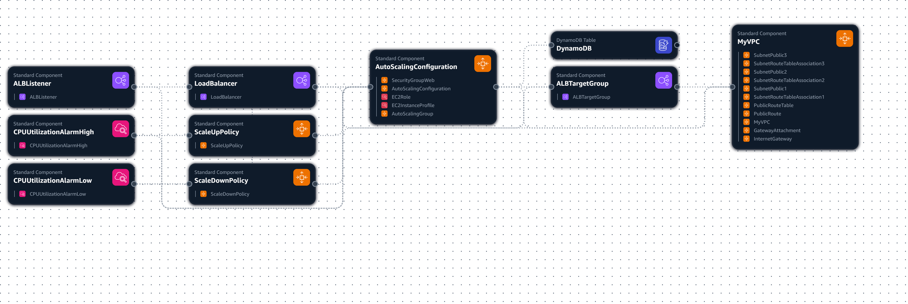
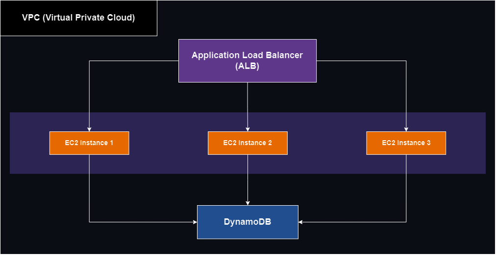
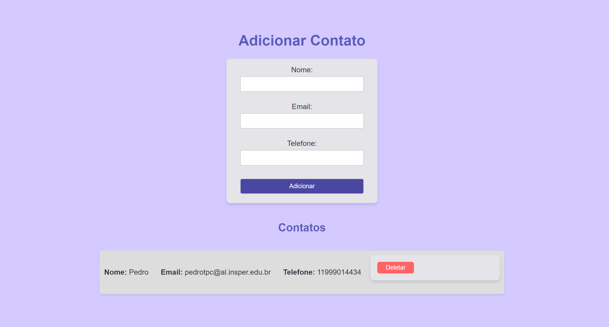
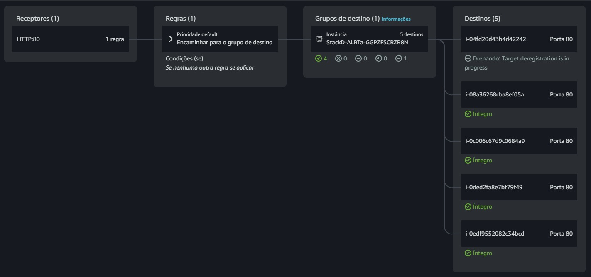
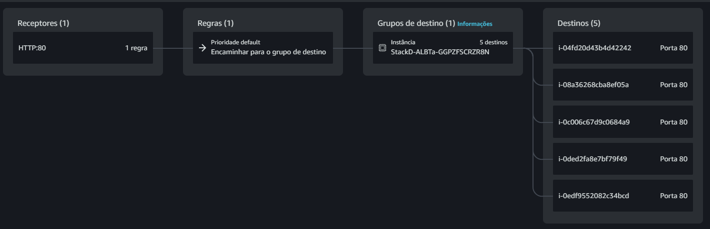
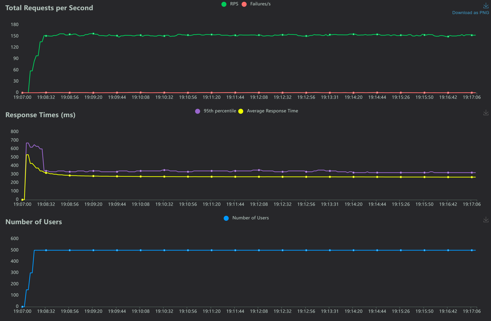
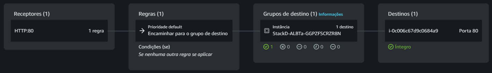
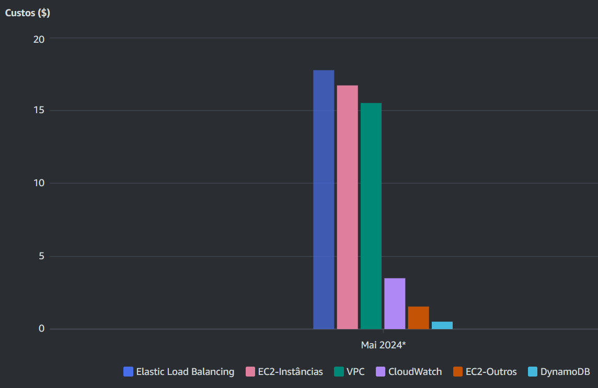
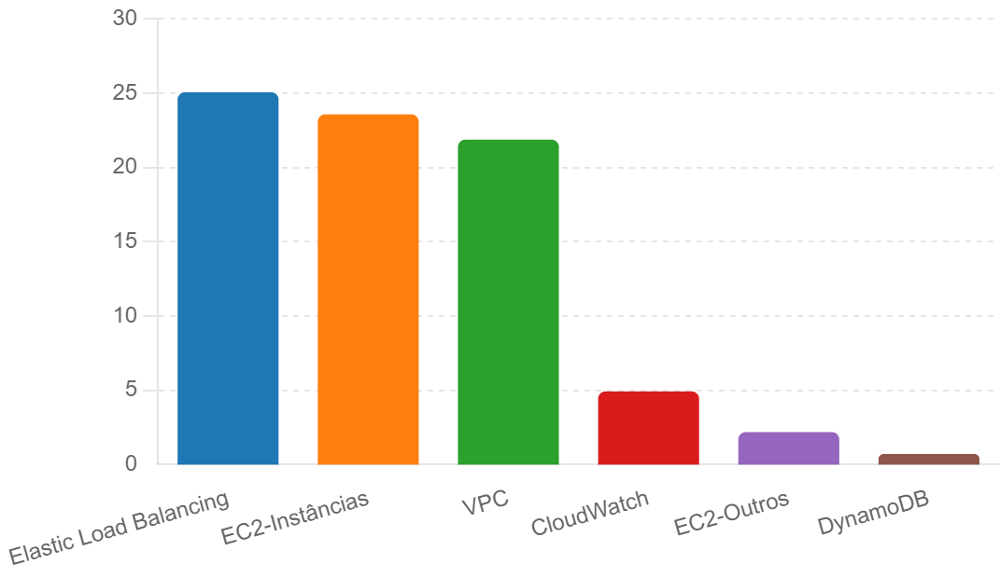

# Documentação do Projeto Final - CloudFormation

### Computação em Nuvem 6º Semestre - Engenharia de Computação, Insper
### Pedro Toledo Piza Civita - Maio de 2024

---

## Sumário

- [Documentação do Projeto Final - CloudFormation](#documentação-do-projeto-final---cloudformation)
- [Objetivo](#objetivo)
- [Diagrama da Arquitetura AWS](#diagrama-da-arquitetura-aws)
  - [Versão Simplificada da Arquitetura](#versão-simplificada-da-arquitetura)
  - [Descrição da Arquitetura](#descrição-da-arquitetura)
  - [Aplicação: Lista de Contatos](#aplicação-lista-de-contatos)
    - [Funcionalidades da Aplicação](#funcionalidades-da-aplicação)
    - [Integração com DynamoDB](#integração-com-dynamodb)
    - [Objetivo da Aplicação](#objetivo-da-aplicação)
    - [Interface da Aplicação](#interface-da-aplicação)
- [Decisões Técnicas](#decisões-técnicas)
  - [Escolha da Região](#escolha-da-região)
  - [Tipos de Instância](#tipos-de-instância)
  - [Configurações de Auto Scaling](#configurações-de-auto-scaling)
  - [Configurações de Segurança](#configurações-de-segurança)
  - [Balanceamento de Carga](#balanceamento-de-carga)
  - [Políticas de Escalabilidade](#políticas-de-escalabilidade)
  - [Banco de Dados NoSQL (DynamoDB)](#banco-de-dados-nosql-dynamodb)
  - [Pré-requisitos](#pré-requisitos)
  - [Conta na AWS](#conta-na-aws)
  - [Ferramentas Necessárias](#ferramentas-necessárias)
  - [Dependências de Software](#dependências-de-software)
    - [Windows](#windows)
    - [Linux](#linux)
    - [Mac](#mac)
  - [Configuração do Ambiente](#configuração-do-ambiente)
  - [Repositório do Projeto](#repositório-do-projeto)
  - [Configuração de Permissões IAM](#configuração-de-permissões-iam)
    - [Passo a Passo para Configurar Permissões IAM](#passo-a-passo-para-configurar-permissões-iam)
- [Guia Passo a Passo](#guia-passo-a-passo)
  - [Configuração Inicial](#configuração-inicial)
  - [Detalhes do Script de Configuração](#detalhes-do-script-de-configuração)
  - [Testes de Carga com Locust](#testes-de-carga-com-locust)
  - [Rodar Locust em Modo Headless](#rodar-locust-em-modo-headless)
  - [Análise dos Testes de Carga](#análise-dos-testes-de-carga)
  - [Instâncias Após o Scale Down](#instâncias-após-o-scale-down)
  - [Destruir a Infraestrutura](#destruir-a-infraestrutura)
  - [Detalhes do Script de Limpeza](#detalhes-do-script-de-limpeza)
  - [Análise de Custo](#análise-de-custo)
    - [Estimativa de Custos Mensais](#estimativa-de-custos-mensais)
    - [Detalhamento dos Custos:](#detalhamento-dos-custos)
    - [Análise Real de Custos](#análise-real-de-custos)
    - [Gráfico dos Custos Reais no Console da AWS](#gráfico-dos-custos-reais-no-console-da-aws)
    - [Gráfico dos Custos Reais Ajustados Para 31 Dias](#gráfico-dos-custos-reais-ajustados-para-31-dias)
- [Tempo Estimado para Execução das Ações](#tempo-estimado-para-execução-das-ações)
- [Comandos Utilizados](#comandos-utilizados)
  - [Criação e Gerenciamento do Bucket S3](#criação-e-gerenciamento-do-bucket-s3)
  - [Gerenciamento da Stack CloudFormation](#gerenciamento-da-stack-cloudformation)
  - [Opção para Acessar Instâncias via SSH](#opção-para-acessar-instâncias-via-ssh)
  - [Comandos de Teste e Monitoramento](#comandos-de-teste-e-monitoramento)
  - [Teste de Carga com Locust](#teste-de-carga-com-locust)
  - [Comandos de Stress Test](#comandos-de-stress-test)
- [Conclusão](#conclusão)
  - [Pontos Principais](#pontos-principais)
  - [Próximos Passos](#próximos-passos)
  - [Agradecimentos](#agradecimentos)
- [Repositório do Código](#repositório-do-código)

---

## Objetivo

Provisionar uma arquitetura na AWS utilizando o CloudFormation, que englobe o uso de um Application Load Balancer (ALB), instâncias EC2 com Auto Scaling e um banco de dados DynamoDB. O objetivo é garantir alta disponibilidade, escalabilidade e desempenho da aplicação.

## Diagrama da Arquitetura AWS



### Versão Simplificada da Arquitetura

Esta versão simplificada da arquitetura destaca os componentes principais e suas conexões essenciais. É uma representação básica que facilita a compreensão do fluxo geral e da estrutura da infraestrutura sem se aprofundar em detalhes complexos.



### Descrição da Arquitetura

1. **VPC (Virtual Private Cloud)**:
   - **Definição**: A VPC é uma rede virtual dedicada à sua conta AWS. Ela permite o provisionamento de uma seção isolada logicamente da Nuvem AWS, onde você pode lançar recursos da AWS em uma rede virtual que você define.
   - **CidrBlock**: Configurado como 10.0.0.0/16, fornecendo até 65.536 endereços IP privados.
   - **Suporte a DNS**: DNS Support e DNS Hostnames estão habilitados para facilitar a resolução de nomes dentro da VPC.

2. **Subnets Públicas**:
   - **Número e Distribuição**: Três subnets públicas, cada uma em uma zona de disponibilidade diferente para garantir alta disponibilidade e tolerância a falhas.
   - **CIDR Blocks**:
     - Subnet 1: 10.0.1.0/24
     - Subnet 2: 10.0.2.0/24
     - Subnet 3: 10.0.3.0/24
   - **Configuração**: MapPublicIpOnLaunch está habilitado para permitir que instâncias EC2 nas subnets públicas obtenham endereços IP públicos automaticamente.

3. **Internet Gateway**:
   - **Função**: Permite a comunicação entre a VPC e a internet. É anexado à VPC para fornecer conectividade à internet para recursos dentro das subnets públicas.

4. **Route Table**:
   - **Propósito**: Define como os pacotes são roteados dentro da VPC. A tabela de rotas pública contém uma rota para o Internet Gateway, permitindo que o tráfego da internet seja roteado para as subnets públicas.
   - **Associações**: Cada subnet pública é associada à tabela de rotas pública, permitindo a comunicação de entrada e saída com a internet.

5. **Security Groups**:
   - **Função**: Atuam como um firewall virtual para instâncias EC2 e outros recursos. O Security Group define regras de tráfego de entrada e saída para controlar a segurança dos recursos.
   - **Configuração**:
     - Permitir tráfego HTTP (porta 80) de qualquer lugar.
     - Permitir tráfego HTTPS (porta 443) de qualquer lugar, se necessário.
     - Permitir tráfego SSH (porta 22) de um IP específico para segurança.

6. **Application Load Balancer (ALB)**:
   - **Propósito**: Distribui automaticamente o tráfego de entrada entre várias instâncias EC2 em múltiplas zonas de disponibilidade, garantindo alta disponibilidade e resiliência.
   - **Configuração**: 
     - Conectado às três subnets públicas.
     - Associado ao Security Group que permite tráfego HTTP e HTTPS.
     - Configurado para escutar na porta 80 e encaminhar o tráfego para o Target Group.

7. **Auto Scaling Group**:
   - **Função**: Garante que o número desejado de instâncias EC2 esteja em execução para lidar com a carga da aplicação. O Auto Scaling pode aumentar ou diminuir a capacidade conforme necessário com base em políticas definidas.
   - **Configuração**:
     - MinSize: 1, MaxSize: 5, DesiredCapacity: 3.
     - Associado ao Target Group do ALB.
     - Configurado com um Launch Configuration que especifica a AMI, tipo de instância e outras configurações de inicialização.
     - UserData script para instalar dependências e configurar a aplicação durante a inicialização da instância.

8. **DynamoDB**:
   - **Função**: Fornece um banco de dados NoSQL altamente disponível e escalável para armazenar dados da aplicação.
   - **Configuração**:
     - Tabela chamada ListaDeContatos.
     - Definida com um atributo de chave primária 'id' do tipo String (S).
     - Modo de cobrança configurado para PAY_PER_REQUEST, eliminando a necessidade de especificar capacidade de leitura/escrita provisionada.
     - Políticas de IAM associadas às instâncias EC2 para permitir acesso completo ao DynamoDB.

### Aplicação: Lista de Contatos

A aplicação "Lista de Contatos" é um sistema de gerenciamento de contatos desenvolvido com Flask e integrado ao Amazon DynamoDB para armazenamento de dados. A aplicação permite adicionar, visualizar e deletar contatos através de uma interface web simples e intuitiva. 

#### Funcionalidades da Aplicação

1. **Adicionar Contatos**: Os usuários podem adicionar novos contatos fornecendo informações como nome, telefone e e-mail.
2. **Visualizar Contatos**: A aplicação exibe uma lista de contatos armazenados no DynamoDB.
3. **Deletar Contatos**: Os usuários têm a opção de deletar contatos da lista.

#### Integração com DynamoDB

A aplicação se comunica com o DynamoDB utilizando a biblioteca `boto3` para Python. Cada contato é armazenado como um item na tabela `ListaDeContatos`, com um identificador único (`id`) para cada registro. A integração permite que a aplicação aproveite a escalabilidade, alta disponibilidade e baixa latência do DynamoDB.

#### Objetivo da Aplicação

O objetivo da aplicação é fornecer um exemplo prático de uma aplicação web que utiliza serviços da AWS para armazenar dados de forma escalável e segura. Ela demonstra como configurar e utilizar uma arquitetura em nuvem com serviços gerenciados da AWS, como EC2, ALB, Auto Scaling e DynamoDB.

#### Interface da Aplicação

Abaixo está a interface da aplicação "Lista de Contatos":



## Decisões Técnicas

### Escolha da Região

A região `us-east-1` foi selecionada devido aos custos mais baixos em comparação com outras regiões, além da proximidade com a base de usuários finais, o que contribui para uma melhor performance e redução da latência. Esta região também oferece uma ampla gama de serviços da AWS e suporte, tornando-a ideal para o projeto.

### Tipos de Instância

Instâncias do tipo `t2.micro` foram escolhidas para o ambiente de desenvolvimento e testes iniciais devido ao seu custo-benefício. Essas instâncias são elegíveis para o nível gratuito da AWS, o que proporciona economia significativa para projetos acadêmicos e experimentais. Além disso, as instâncias `t2.micro` são suficientemente potentes para suportar a carga de trabalho prevista durante a fase inicial do projeto.

### Configurações de Auto Scaling

Políticas de Auto Scaling foram configuradas com base em métricas de utilização da CPU para garantir alta disponibilidade e desempenho da aplicação:
- **Escalamento para cima:** Aumenta o número de instâncias quando a utilização da CPU ultrapassa 5%, permitindo que o sistema lide com aumentos repentinos de tráfego e carga.
- **Escalamento para baixo:** Reduz o número de instâncias quando a utilização da CPU cai abaixo de 1%, otimizando os custos operacionais ao ajustar automaticamente os recursos conforme a demanda diminui.

### Configurações de Segurança

Um Security Group foi implementado para garantir a segurança das instâncias EC2 e do DynamoDB:
- **Security Group para EC2:** Este grupo permite acesso à aplicação na porta 80 (HTTP) de qualquer lugar, garantindo que a aplicação web esteja acessível para todos os usuários. O acesso

 SSH na porta 22 é restrito ao IP específico do administrador (177.170.241.150/32), proporcionando uma camada adicional de segurança ao limitar o acesso administrativo.
- **Políticas de IAM:** As instâncias EC2 foram configuradas com uma role do IAM que permite acesso completo ao DynamoDB. Isso inclui ações como Scan, GetItem, PutItem, UpdateItem e DeleteItem na tabela `ListaDeContatos`, garantindo que as instâncias possam interagir com o banco de dados conforme necessário.

### Balanceamento de Carga

Um Application Load Balancer (ALB) foi configurado para distribuir automaticamente o tráfego de entrada entre as instâncias EC2 em múltiplas zonas de disponibilidade, garantindo alta disponibilidade e resiliência:
- **Configuração do ALB:** O ALB está configurado para escutar na porta 80 e redirecionar o tráfego para um Target Group que contém as instâncias EC2. Isso assegura que o tráfego seja distribuído de maneira uniforme e eficiente, proporcionando uma melhor experiência ao usuário final.
- **Monitoramento e Saúde:** O ALB está configurado para realizar verificações de saúde nas instâncias EC2, removendo automaticamente instâncias não saudáveis e redirecionando o tráfego para as instâncias saudáveis restantes.

### Políticas de Escalabilidade

Além do Auto Scaling baseado em CPU, políticas adicionais foram configuradas para ajustar a capacidade com base na utilização da CPU:
- **Política de Escalamento para Cima (ScaleUpPolicy):** Adiciona uma nova instância quando a utilização da CPU ultrapassa 5% por dois períodos consecutivos de 30 segundos.
- **Política de Escalamento para Baixo (ScaleDownPolicy):** Remove uma instância quando a utilização da CPU cai abaixo de 1% por dois períodos consecutivos de 30 segundos.

### Banco de Dados NoSQL (DynamoDB)

O DynamoDB foi escolhido como o banco de dados NoSQL devido à sua capacidade de escalabilidade, alta disponibilidade e baixo tempo de resposta:
- **Configuração da Tabela:** A tabela `ListaDeContatos` foi configurada com um esquema de chave primária simples utilizando o atributo `id` do tipo String. O modo de cobrança PAY_PER_REQUEST foi selecionado para facilitar a escalabilidade automática da capacidade de leitura e escrita com base na demanda.
- **Segurança:** O acesso ao DynamoDB é restrito às instâncias EC2 dentro do mesmo VPC, garantindo que apenas as instâncias autorizadas possam interagir com o banco de dados.

Essas decisões técnicas foram tomadas para garantir uma arquitetura robusta, segura e altamente disponível, capaz de escalar conforme necessário para atender às demandas da aplicação, enquanto otimiza os custos operacionais e mantém a segurança dos dados e recursos.

### Pré-requisitos

Para garantir o funcionamento correto do programa e a implantação bem-sucedida da infraestrutura descrita, são necessários os seguintes pré-requisitos:

### Conta na AWS

- **Conta AWS ativa:** Uma conta AWS com permissões suficientes para criar e gerenciar recursos como VPC, EC2, ALB, DynamoDB, IAM roles e políticas.
- **Chave de Acesso:** Chave de acesso (Access Key ID e Secret Access Key) configurada para permitir o uso do AWS CLI.

### Ferramentas Necessárias

- **AWS CLI:** A ferramenta de linha de comando AWS CLI deve estar instalada e configurada em seu ambiente local.
  - [Instruções de instalação da AWS CLI](https://docs.aws.amazon.com/cli/latest/userguide/install-cliv2.html)

- **CloudFormation:** Familiaridade com o AWS CloudFormation para criar e gerenciar stacks.
  - [Guia do usuário do AWS CloudFormation](https://docs.aws.amazon.com/AWSCloudFormation/latest/UserGuide/Welcome.html)

- **Git:** Ferramenta de controle de versão Git instalada para clonar o repositório do projeto.
  - [Instruções de instalação do Git](https://git-scm.com/book/en/v2/Getting-Started-Installing-Git)

### Dependências de Software

#### Windows

- **Python 3.x:** Instale o Python 3.x e o pip (gerenciador de pacotes do Python) a partir do site oficial.
  - [Instruções de instalação do Python](https://www.python.org/downloads/)
  
  ```powershell
  pip install locust
  ```

#### Linux

- **Python 3.x:** Instale o Python 3.x e o pip utilizando o gerenciador de pacotes de sua distribuição.
  
  ```bash
  sudo apt-get update
  sudo apt-get install python3 python3-pip
  pip3 install locust
  ```

#### Mac

- **Python 3.x:** Instale o Python 3.x e o pip utilizando Homebrew.
  
  ```bash
  brew install python
  pip3 install locust
  ```

### Configuração do Ambiente

- **Configuração do AWS CLI:** Configure o AWS CLI com suas credenciais de acesso.

  ```bash
  aws configure
  ```

  Durante a configuração, você será solicitado a inserir as seguintes informações:

  - **AWS Access Key ID:** Insira a sua chave de acesso da AWS.
  - **AWS Secret Access Key:** Insira a sua chave secreta de acesso da AWS.
  - **Default region name:** Insira `us-east-1` (ou outra região preferida).
  - **Default output format:** Insira `json`.

### Repositório do Projeto

- **Clonagem do Repositório:** Clone o repositório do projeto a partir do GitHub.

  ```bash
  git clone https://github.com/pedrocivita/pedrotpcProjetoCloudFormation
  ```

### Configuração de Permissões IAM

O usuário precisará configurar as seguintes políticas de permissão em sua conta AWS para garantir que a infraestrutura e a aplicação funcionem corretamente:

- **AdministratorAccess**
- **AmazonDynamoDBFullAccess**
- **AmazonEC2FullAccess**
- **AmazonSSMFullAccess**
- **AWSCloudFormationFullAccess**
- **AWSCodeDeployFullAccess**
- **AWSCostAndUsageReportAutomationPolicy**
- **ElasticLoadBalancingFullAccess**
- **IAMFullAccess**
- **IAMUserChangePassword**

#### Passo a Passo para Configurar Permissões IAM

1. Acesse o [Console de Gerenciamento da AWS](https://aws.amazon.com/console/).
2. Navegue até o serviço **IAM (Identity and Access Management)**.
3. Crie um novo usuário ou selecione um usuário existente.
4. Atribua as políticas acima ao usuário selecionado:
   - Vá para a aba **Permissions**.
   - Clique em **Add permissions**.
   - Selecione **Attach policies directly**.
   - Pesquise e selecione as políticas listadas acima.
   - Clique em **Next: Review** e depois em **Add permissions**.

Caso o usuário já tenha um usuário configurado, apenas verifique se todas as políticas acima estão atribuídas ao usuário. Isso garantirá que ele tenha as permissões necessárias para criar e gerenciar os recursos descritos no projeto.

Com esses pré-requisitos atendidos, você estará pronto para implantar a infraestrutura e a aplicação utilizando o AWS CloudFormation e outras ferramentas descritas.

## Guia Passo a Passo

### Configuração Inicial

1. **Clone o Repositório do GitHub e Acesse o Diretório do Projeto:**

   ```bash
   git clone https://github.com/pedrocivita/pedrotpcProjetoCloudFormation
   cd pedrotpcProjetoCloudFormation
   ```

2. **Dar Permissão de Execução aos Scripts (Linux):**

   ```bash
   chmod +x scriptsSetupCleanup/setup.sh scriptsSetupCleanup/cleanup.sh
   ```

3. **Executar o Script de Configuração:**

   Para Windows:
   ```powershell
   .\scriptsSetupCleanup\setup.ps1
   ```

   Para Linux:
   ```bash
   ./scriptsSetupCleanup/setup.sh
   ```

### Detalhes do Script de Configuração

O script de configuração realiza as seguintes etapas:

1. **Criação de um Bucket S3:**
   ```bash
   aws s3 mb s3://bucket-do-civita --region us-east-1
   ```

2. **Upload dos Arquivos da Aplicação para o Bucket S3:**
   ```bash
   aws s3 cp appFiles/app.py s3://bucket-do-civita/app.py
   aws s3 cp appFiles/dynamo_service.py s3://bucket-do-civita/dynamo_service.py
   aws s3 cp appFiles/home.html s3://bucket-do-civita/home.html
   ```

3. **Validação do Template CloudFormation:**
   ```bash
   aws cloudformation validate-template --template-body file://full-stack.yaml
   ```

4. **Criação da Stack CloudFormation:**
   ```bash
   aws cloudformation create-stack --stack-name StackDoCivitaApp --template-body file://full-stack.yaml --capabilities CAPABILITY_IAM CAPABILITY_NAMED_IAM CAPABILITY_AUTO_EXPAND
   ```

### Testes de Carga com Locust

1. **Instalar e Executar o Locust:**

   ```bash
   pip install locust
   locust -f locustfile.py
   ```

2. **Acessar a Interface do Locust:**
   
   Abra o navegador e acesse `http://localhost:8089`.

3. **Configurar e Iniciar os Testes de Carga:**

   Configure o número de usuários simulados e a taxa de spawn (usuários/segundo). Inicie o teste e observe o comportamento da sua aplicação sob carga.

### Rodar Locust em Modo Headless

Para executar o Locust sem a interface gráfica, utilize o seguinte comando:

   ```bash
   locust -f locustfile.py --headless -u 500 -r 50 --run-time 10m
   ```

Este comando executa o teste com 500 usuários, aumentando 50 usuários por segundo, durante um tempo de execução de 10 minutos.

### Análise dos Testes de Carga

Durante o teste de carga com 500 usuários e um ramp up de 50 usuários por segundo por 10 minutos, novas instâncias EC2 foram criadas automaticamente pelo Auto Scaling Group para lidar com o aumento na demanda. Isso mostra que o Auto Scaling está configurado corretamente e está respondendo adequadamente aos aumentos de carga, conforme esperado.

Aqui estão as imagens mostrando as instâncias EC2 durante o teste de carga:

- **Instâncias com Detalhes:**


- **Instâncias sem Detalhes:**


Além disso, a interface do Locust forneceu gráficos detalhados do desempenho durante o teste:



Os gráficos mostram:

1. **Total Requests per Second:** A taxa de solicitações por segundo durante o teste.
2. **Response Times (ms):** Os tempos de resposta médios e do percentil 95 ao longo do teste.
3. **Number of Users:** O número de usuários simulados ativos durante o teste.

Durante o teste, o Application Load Balancer (ALB) distribuiu o tráfego de entrada de maneira eficiente entre as instâncias EC2 disponíveis. Algumas instâncias começaram a drenar quando o teste terminou, demonstrando que o sistema de auto scaling conseguiu reduzir o número de instâncias quando a carga diminuiu.

A análise dos alarmes configurados no CloudWatch para monitorar a utilização da CPU foi fundamental. Os alarmes de escalonamento para cima (`ScaleUpPolicy`) e para baixo (`ScaleDownPolicy`) foram eficazes em ajustar a capacidade do Auto Scaling Group conforme necessário.

### Instâncias Após o Scale Down

Após um período de tempo após o teste do Locust, o número de instâncias foi reduzido para uma, conforme mostrado na imagem abaixo, demonstrando a efetividade do Auto Scaling em reduzir a capacidade quando a demanda diminui:

- **Instâncias Após o Scale Down:**


A análise desses testes confirma que a arquitetura está configurada para suportar altos volumes de tráfego, garantindo alta disponibilidade e escalabilidade. A resposta rápida aos aumentos de carga também ajuda a manter a performance da aplicação durante picos de uso.

### Destruir a Infraestrutura

1. **Executar o Script de Limpeza:**

   Para Windows:
   ```powershell
   .\scriptsSetupCleanup\cleanup.ps1
   ```

   Para Linux:
   ```bash
   ./scriptsSetupCleanup/cleanup.sh
   ```

### Detalhes do Script de Limpeza

O script de limpeza realiza as seguintes etapas:

1. **Deletar a Stack CloudFormation:**
   ```bash
   aws cloudformation delete-stack --stack-name StackDoCivitaApp
   ```

2. **Aguardar a Deleção da Stack:**
   ```powershell
   while ((aws cloudformation describe-stacks --stack-name StackDoCivitaApp).Stacks[0].StackStatus -eq 'DELETE_IN_PROGRESS') {
       Start-Sleep -Seconds 30
   }
   ```

3. **Deletar o Bucket S3:**
   ```bash
   aws s3 rb s3://bucket-do-civita --force
   ```

### Análise de Custo

#### Estimativa de Custos Mensais

Foi utilizada a Calculadora de Custos da AWS para estimar os custos mensais da arquitetura. Os principais componentes incluem:

- **EC2 Instances:** Utilização de instâncias `t2.micro` para o Auto Scaling Group.
- **Application Load Balancer:** Para distribuir o tráfego.
- **Amazon Virtual Private Cloud (VPC):** Para criar uma rede virtual isolada para os recursos AWS.
- **Amazon CloudWatch:** Para monitoramento e gerenciamento de logs.
- **DynamoDB:** Banco de dados NoSQL para armazenar dados da aplicação.

#### Detalhamento dos Custos:

- **EC2 Instances:** 
  - **Cálculo:** 3 instâncias `t2.micro` x $0.0116 por hora x 730 horas por mês = $25.40

- **Application Load Balancer (ALB):**
  - **Cálculo:** Utilização média resultando em $31.11

- **Amazon Virtual Private Cloud (VPC):**
  - **Cálculo:** Estimado em $12.78 incluindo transferência de dados e uso de endpoints

- **Amazon CloudWatch:** 
  - **Cálculo:** Monitoramento e logs resultando em um custo estimado de $3.06

- **DynamoDB:** 
  - **Cálculo:** 
    - Armazenamento de dados: 1 GB x $0.25 = $0.25
    - Gravações: 2 gravações por segundo x $0.00000125 = $6.57
    - Leituras: 4 leituras por segundo x $0.00000025 = $1.31
  - **Total DynamoDB:** $8.13

| Recurso                    | Custo Estimado Mensal |
|----------------------------|-----------------------|
| EC2 Instances              | $25.40                |
| Application Load Balancer  | $31.11                |
| Amazon Virtual Private Cloud (VPC) | $12.78       |
| Amazon CloudWatch          | $3.06                 |
| DynamoDB                   | $8.13                 |
| **Total**                  | $80.48                |

#### Análise Real de Custos

Após a implementação e o teste da infraestrutura, foram verificados os custos reais utilizando os dados do console da AWS. Os custos reais ajustados para 31 dias foram:

| Recurso                    | Custo Real Mensal     |
|----------------------------|-----------------------|
| Elastic Load Balancing     | $25.07                |
| EC2-Instâncias             | $23.58                |
| Amazon Virtual Private Cloud (VPC) | $21.88       |
| Amazon CloudWatch          | $4.93                 |
| EC2-Outros                 | $2.19                 |
| DynamoDB                   | $0.72                 |
| **Total**                  | $78.38                |

As diferenças entre as estimativas e os custos reais foram principalmente devido a variações no uso e tarifas reais da AWS.

#### Gráfico dos Custos Reais no Console da AWS



#### Gráfico dos Custos Reais Ajustados Para 31 Dias



## Tempo Estimado para Execução das Ações

| Ação                              | Tempo Estimado            |
|-----------------------------------|---------------------------|
| Criação do Bucket S3              | 5 segundos               |
| Upload dos Arquivos para o S3     | 10 segundos               |
| Validação do Template             | 3 segundos                  |
| Criação da Stack CloudFormation   | 3-5 minutos              |
| Execução do Script de Limpeza     | 2-3 minutos               |
| Instalação e Configuração do Locust| 1 minuto                 |

## Comandos Utilizados

### Criação e Gerenciamento do Bucket S3

- **Criar bucket:**
  ```bash
  aws s3 mb s3://bucket-do-civita --region us-east-1
  ```

- **Upload do app 'app.py':**
  ```bash
  aws s3 cp appFiles/app.py s3://bucket-do-civita/app.py
  ```

- **Upload dos serviços DynamoDB:**
  ```bash
  aws s3 cp appFiles/dynamo_service.py s3://bucket-do-civita/dynamo_service.py
  ```

- **Upload do 'home.html':**
  ```bash
  aws s3 cp appFiles/home.html s3://bucket-do-civita/home.html
  ```

- **Deletar bucket:**
  ```bash
  aws s3 rb s3://bucket-do-civita --force
  ```

### Gerenciamento da Stack CloudFormation

- **Validar template:**
  ```bash
  aws cloudformation validate-template --template-body file://full-stack.yaml
  ```

- **Criar stack:**
  ```bash
  aws cloudformation create-stack --stack-name StackDoCivitaApp --template-body file://full-stack.yaml --capabilities CAPABILITY_IAM CAPABILITY_NAMED_IAM CAPABILITY_AUTO_EXPAND
  ```

- **Atualizar stack:**
  ```bash
  aws cloudformation update-stack --stack-name StackDoCivitaApp --template-body file://full-stack.yaml --capabilities CAPABILITY_IAM CAPABILITY_NAMED_IAM CAPABILITY_AUTO_EXPAND
  ```

- **Deletar stack:**
  ```bash
  aws cloudformation delete-stack --stack-name StackDoCivitaApp
  ```

### Opção para Acessar Instâncias via SSH

Se você deseja acessar diretamente as instâncias EC2 para fins de depuração ou manutenção, use o par de chaves SSH `pedrotpcKeyPair` especificado no `LaunchConfiguration`. Para acessar uma instância via SSH, execute o comando abaixo no terminal (Linux/Mac) ou no Git Bash (Windows):

```bash
ssh -i path/to/pedrotpcKeyPair.pem ec2-user@<Public_IP_da_instância>
```

Substitua `path/to/pedrotpcKeyPair.pem` pelo caminho do arquivo de chave privada e `<Public_IP_da_instância>` pelo endereço IP público da instância EC2.

### Comandos de Teste e Monitoramento

Execute os seguintes comandos diretamente na instância EC2 (via SSH) para monitorar e gerenciar o servidor web:

- **Verificar status do servidor web:**
  ```bash
  sudo systemctl status flaskapp.service
  ```

- **Iniciar servidor web:**
  ```bash
  sudo systemctl start flaskapp.service
  ```

- **Checar logs para erros:**
  ```bash
  sudo journalctl -u flaskapp.service
  ```

- **Verificar a saída do log de UserData:**
  ```bash
  cat /var/log/user-data.log
  ```

### Teste de Carga com Locust

Instale e execute Locust no ambiente local (Windows/Linux/Mac):

- **Instalar Locust:**
  ```bash
  pip install locust
  ```

- **Rodar Locust:**
  ```bash
  locust -f locustfile.py
  ```

- **Acessar a interface do Locust:**
  Abra o navegador e acesse `http://localhost:8089`.

### Comandos de Stress Test

Para executar um stress test diretamente na instância EC2 (via SSH), instale e utilize a ferramenta `stress`:

- **Instalar ferramenta de stress:**
  ```bash
  sudo yum install -y stress
  ```

- **Executar stress test:**
  ```bash
  stress --cpu 2 --timeout 300
  ```

Esses comandos ajudarão a garantir que a infraestrutura e a aplicação estejam funcionando corretamente e permitirão testes de carga e monitoramento eficazes.

## Conclusão

Este projeto demonstrou a capacidade de provisionar e gerenciar uma arquitetura robusta na AWS utilizando CloudFormation, assegurando alta disponibilidade e escalabilidade com o uso de Application Load Balancer (ALB), Auto Scaling Group e DynamoDB. O processo incluiu desde a criação e configuração inicial dos recursos até testes de carga e monitoramento para validar a performance e eficiência da infraestrutura.

### Pontos Principais

1. **Provisionamento Automatizado:** Utilizando CloudFormation, conseguimos automatizar a criação e gestão da infraestrutura, garantindo consistência e eficiência no processo de implantação.
2. **Alta Disponibilidade e Escalabilidade:** A arquitetura configurada com ALB e Auto Scaling Group garantiu que a aplicação pudesse lidar com variações na carga de trabalho de maneira eficiente, mantendo a performance e disponibilidade.
3. **Integração com DynamoDB:** A escolha do DynamoDB como banco de dados NoSQL proporcionou uma solução escalável e altamente disponível para armazenar os dados da aplicação.
4. **Análise de Custo:** A análise detalhada dos custos estimados e reais ajudou a entender melhor os gastos envolvidos na manutenção da infraestrutura, possibilitando ajustes e otimizações conforme necessário.
5. **Testes de Carga e Stress:** Os testes de carga realizados com Locust e os comandos de stress test garantiram que a aplicação pudesse suportar altos volumes de tráfego e que o Auto Scaling estivesse configurado corretamente.

### Próximos Passos

- **Monitoramento Contínuo:** Implementar um sistema de monitoramento contínuo para detectar e resolver problemas proativamente.
- **Otimização de Custos:** Revisar periodicamente os custos e explorar opções de otimização, como instâncias reservadas ou savings plans, para reduzir gastos.
- **Melhoria de Segurança:** Continuar melhorando as políticas de segurança e práticas recomendadas para proteger os dados e recursos da aplicação.
- **Escalabilidade Horizontal:** Explorar técnicas de escalabilidade horizontal, como sharding no DynamoDB, para lidar com aumentos significativos de dados e tráfego.

### Agradecimentos

Gostaria de agradecer aos professores e colegas de classe pelo apoio e orientação ao longo deste projeto. A experiência adquirida será extremamente valiosa para futuros desafios profissionais na área de computação em nuvem.

## Repositório do Código

O código do CloudFormation e os scripts utilizados estão disponíveis no seguinte repositório do GitHub: [pedrotpcProjetoCloudFormation](https://github.com/pedrocivita/pedrotpcProjetoCloudFormation).